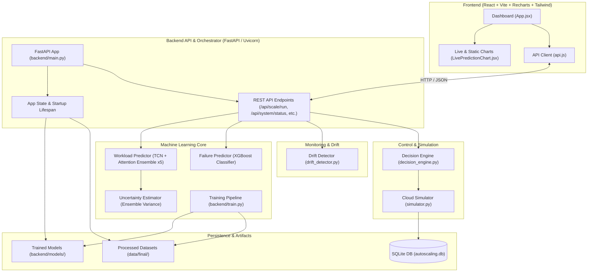
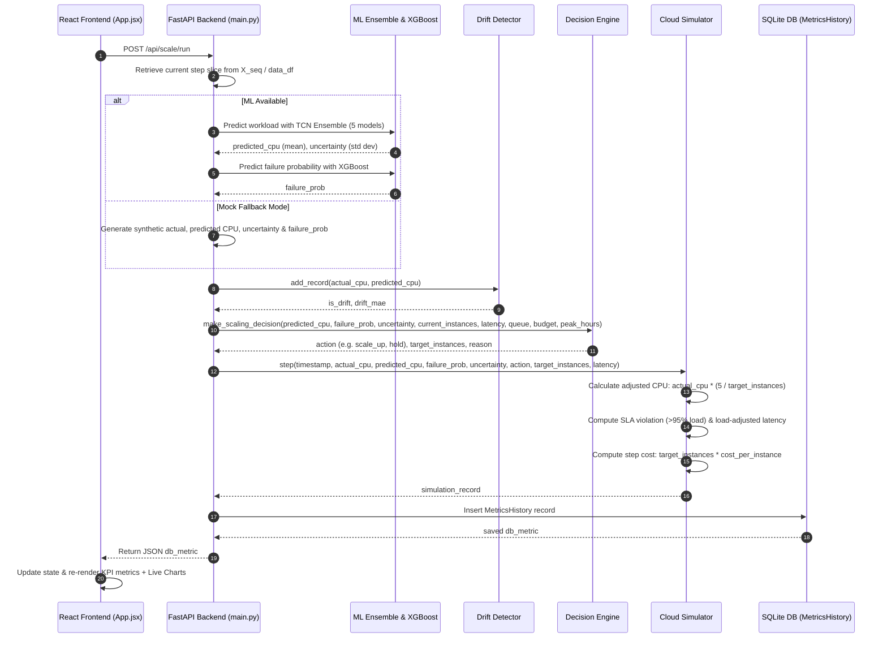
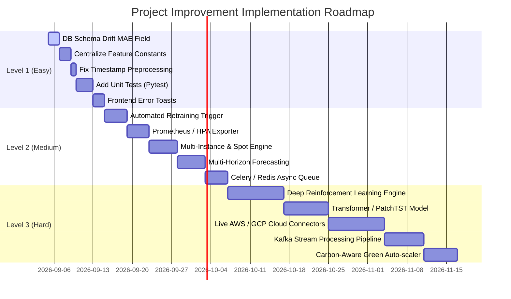

# AutoScale Intelligence AI: Project Flow, Architecture, and Implementation Roadmap

## Executive Summary

**AutoScale Intelligence AI** is an advanced, hybrid machine-learning framework and real-time simulation system designed for **proactive, cost-aware, and SLA-driven cloud auto-scaling**. 

Unlike traditional reactive auto-scalers (e.g., standard AWS Auto Scaling Groups or Kubernetes HPA relying solely on CPU threshold triggers), this project combines:
1. **Workload Forecasting**: Deep temporal convolutional networks (TCN + Attention) predicting future CPU usage and request rates.
2. **Uncertainty Estimation**: Multi-model deep ensemble variance measurement to quantify model confidence.
3. **Failure Risk Classification**: Cost-weighted XGBoost classification predicting imminent system failure risks.
4. **Drift Monitoring**: Rolling Mean Absolute Error (MAE) drift detection to track concept drift in real time.
5. **Smart Decision Engine**: Rules layer evaluating predictive CPU, risk, uncertainty, SLA bounds, and budget limits.
6. **Cloud Simulator**: Discrete-step simulation of compute instances, SLA violations, load adjustment, and operational cost.
7. **React/Vite Dashboard**: Glassmorphic web UI for monitoring, step-by-step stepping, auto-simulation, and triggering background training.

---

## High-Level Architecture

The system follows a decoupled **Client-Server & ML Engine** architecture. The React frontend interacts with the FastAPI backend via RESTful endpoints, while the backend orchestrates dataset preprocessors, model inference/training, SQLite persistence, and discrete cloud simulation.



---

## End-to-End System Flow

The system operates across three main lifecycle phases: **Data Pipeline**, **Model Training**, and **Live Simulation Step Execution**.

### 1. Data Pipeline Flow
```
Raw CSV Telemetry (data/raw/*.csv)
   │
   ▼ merge_dataset.py
Merged Dataset (data/processed/merged_dataset.csv)
   │
   ▼ clean_dataset.py
Cleaned Dataset (data/processed/cleaned_dataset.csv)
   │
   ▼ build_final_dataset.py
Final Engineered Dataset (data/final/final_dataset.csv)
   │ (Adds request_rate, queue_length, latency, error_rate, overload_label, failure_label, time features)
   ▼ feature_engineering.py (preprocess_and_engineer_features)
Ready Supervised Dataset (data/final/final_dataset_ready.csv)
   │ (Creates shifted targets: future_cpu_usage, future_request_rate, future_failure)
   ▼ create_sequences (seq_length=12)
Windowed Sequence Arrays X: (N, 12, features), y: (N, targets)
```

### 2. Live Simulation Step Sequence Diagram

When the user clicks **"Step Forward"** or when **"Auto Simulate"** is active, the following step-by-step workflow occurs:



---

## Detailed Codebase Breakdown

### 1. Backend Core & Management

* **[backend/main.py](file:///f:/MAJOR_PROJECT_FINAL/major/backend/main.py)**: The main entry point for FastAPI. Manages startup lifespan, loads models into global state, maintains system state (`AppState`), provides REST endpoints (`/api/system/status`, `/api/scale/run`, `/api/metrics/current`, `/api/timeline`, `/api/predictions/latest`, `/api/model/train`), and handles fallback to Mock AI mode if ML dependencies are missing.
* **[backend/train.py](file:///f:/MAJOR_PROJECT_FINAL/major/backend/train.py)**: Offline & background model training pipeline script. Preprocesses dataset, scales features via `MinMaxScaler`, trains a 5-model TCN+Attention ensemble for workload prediction, trains an XGBoost classifier for failure prediction with non-shuffled time-series train/test split and class imbalance weighting (`scale_pos_weight`), and evaluates with detailed metrics (Precision, Recall, F1, ROC-AUC).
* **[backend/inference.py](file:///f:/MAJOR_PROJECT_FINAL/major/backend/inference.py)**: Standalone offline batch inference script for executing simulation over the dataset and exporting results to CSV (`data/simulation_results.csv`).
* **[backend/database.py](file:///f:/MAJOR_PROJECT_FINAL/major/backend/database.py)**: SQLAlchemy database session setup for SQLite (`sqlite:///./backend/db/autoscaling.db`).
* **[backend/db_models.py](file:///f:/MAJOR_PROJECT_FINAL/major/backend/db_models.py)**: ORM schema defining `MetricsHistory` table.
* **[backend/schemas.py](file:///f:/MAJOR_PROJECT_FINAL/major/backend/schemas.py)**: Pydantic schemas (`MetricOut`, `SystemStatus`) for API response serialization.

### 2. Machine Learning & Feature Engine (`backend/src/`)

* **[backend/src/models/workload_predictor.py](file:///f:/MAJOR_PROJECT_FINAL/major/backend/src/models/workload_predictor.py)**: Defines `AttentionLayer` (custom Keras temporal attention layer) and `build_workload_model()`. Uses Temporal Convolutional Network (`TCN` with dilations `[1, 2, 4, 8, 16]`) combined with Attention to output predictions for `future_cpu_usage` and `future_request_rate`.
* **[backend/src/models/uncertainty_estimator.py](file:///f:/MAJOR_PROJECT_FINAL/major/backend/src/models/uncertainty_estimator.py)**: Implements `EnsemblePredictor`, computing median prediction across 5 Keras models and using inter-model standard deviation as the uncertainty score.
* **[backend/src/models/failure_predictor.py](file:///f:/MAJOR_PROJECT_FINAL/major/backend/src/models/failure_predictor.py)**: Wraps XGBoost classifier training with `scale_pos_weight` handling, plus save/load helper functions via `joblib`.
* **[backend/src/monitoring/drift_detector.py](file:///f:/MAJOR_PROJECT_FINAL/major/backend/src/monitoring/drift_detector.py)**: Implements `DriftDetector` using rolling double-ended queues (`deque`, default window 50) computing rolling MAE between actual and predicted CPU usage against a threshold.
* **[backend/src/decision_engine.py](file:///f:/MAJOR_PROJECT_FINAL/major/backend/src/decision_engine.py)**: Rules-based hybrid auto-scaling decision logic. Evaluates emergency SLA overrides (latency > 500ms, queue > 1000, risk > 0.85), risk mitigation, peak hour thresholds, budget constraints, and uncertainty flags to output actions (`urgent_scale_up`, `scale_up`, `conservative_scaling`, `scale_down`, `hold`).
* **[backend/src/simulator.py](file:///f:/MAJOR_PROJECT_FINAL/major/backend/src/simulator.py)**: Simulates cloud instance state transitions. Recalculates effective CPU usage ($\text{actual\_cpu} \times \frac{5}{\text{current\_instances}}$), flags SLA violations (>95% load), adjusts latency under heavy load, and tracks financial cost.
* **[backend/src/build_final_dataset.py](file:///f:/MAJOR_PROJECT_FINAL/major/backend/src/build_final_dataset.py)**: Converts raw server metrics into normalized features (`cpu_usage`, `memory_usage`, `disk_io`, `network_usage`), synthesizes realistic workload fields (`request_rate`, `queue_length`, `latency`, `error_rate`), derives threshold-based labels (`overload_label`, `failure_label`), and creates time bucket features (`hour_of_day`, `day_of_week`, `minute_bucket`).
* **[backend/src/feature_engineering.py](file:///f:/MAJOR_PROJECT_FINAL/major/backend/src/feature_engineering.py)**: Shifts target columns to form supervised labels (`future_cpu_usage`, `future_request_rate`, `future_failure`) and constructs 3D windowed arrays (`create_sequences`) for TCN input.
* **[backend/src/clean_dataset.py](file:///f:/MAJOR_PROJECT_FINAL/major/backend/src/clean_dataset.py)** & **[merge_dataset.py](file:///f:/MAJOR_PROJECT_FINAL/major/backend/src/merge_dataset.py)**: Scripts for merging raw CSVs (`sep=';'`) and stripping invalid/duplicate records.
* **[backend/src/validate_dataset.py](file:///f:/MAJOR_PROJECT_FINAL/major/backend/src/validate_dataset.py)**: Sanity check module that inspects correlations, missing values, class distributions, and outputs a feature correlation heatmap.

### 3. Frontend Dashboard (`frontend/src/`)

* **[frontend/src/App.jsx](file:///f:/MAJOR_PROJECT_FINAL/major/frontend/src/App.jsx)**: Main dashboard page component. Features header controls (Train, Step Forward, Auto Simulate), top KPI card row (Active Instances, Predicted CPU, Failure Risk, Decision Cost, Decision Logic / Drift Alert), static CSV chart visualization using Recharts `ComposedChart`, and automatic 2-second interval polling.
* **[frontend/src/LivePredictionChart.jsx](file:///f:/MAJOR_PROJECT_FINAL/major/frontend/src/LivePredictionChart.jsx)**: Real-time dynamic chart component plotting actual vs. predicted CPU usage over simulation steps.
* **[frontend/src/api.js](file:///f:/MAJOR_PROJECT_FINAL/major/frontend/src/api.js)**: Axios HTTP service client connecting to backend endpoints.

---

## Mathematical & Algorithmic Specifications

### 1. Workload Forecasting (TCN + Attention)
Given input sequence $X \in \mathbb{R}^{T \times F}$ where $T=12$ steps and $F=11$ features:
$$Z = \text{TCN}(X)$$
where $\text{TCN}$ uses causal 1D convolutions with dilations $d \in \{1, 2, 4, 8, 16\}$ and kernel size $k=3$.

The temporal attention layer computes context score vectors:
$$e_t = \tanh(Z_t W + b)$$
$$a_t = \frac{\exp(e_t)}{\sum_{k=1}^{T} \exp(e_k)}$$
$$c = \sum_{t=1}^{T} a_t Z_t$$
The final dense layer predicts future CPU and request rate:
$$\hat{y} = W_{\text{out}} c + b_{\text{out}}$$

### 2. Uncertainty Estimation
Using $M = 5$ ensemble models:
$$\mu_{\text{cpu}} = \text{median}(\hat{y}^{(1)}_{\text{cpu}}, \dots, \hat{y}^{(M)}_{\text{cpu}})$$
$$\sigma_{\text{cpu}} = \sqrt{\frac{1}{M} \sum_{m=1}^{M} (\hat{y}^{(m)}_{\text{cpu}} - \bar{y}_{\text{cpu}})^2}$$
Uncertainty score $U = \sigma_{\text{cpu}}$. When $U > 10.0$, scaling down is suspended to prevent premature scaling under model ambiguity.

### 3. Cloud Simulator Dynamics
For baseline instance count $I_{\text{base}} = 5$ and current active instances $I$:
$$\text{CPU}_{\text{adjusted}} = \text{CPU}_{\text{actual}} \times \left(\frac{I_{\text{base}}}{I}\right)$$

$$\text{SLA Violation} = \begin{cases} 1 & \text{if } \text{CPU}_{\text{adjusted}} > 95\% \\ 0 & \text{otherwise} \end{cases}$$

$$\text{Latency}_{\text{adjusted}} = \begin{cases} \text{Latency} \times \left(\frac{\text{CPU}_{\text{adjusted}}}{90}\right) & \text{if } \text{CPU}_{\text{adjusted}} > 90 \\ \text{Latency} & \text{otherwise} \end{cases}$$

$$\text{Step Cost} = I \times C_{\text{instance}} \quad (C_{\text{instance}} = \$0.10)$$

### 4. Drift Detector (Rolling MAE)
Over a sliding window of size $W = 50$:
$$\text{MAE} = \frac{1}{W} \sum_{i=1}^{W} |\text{CPU}_{\text{actual}, i} - \text{CPU}_{\text{predicted}, i}|$$
$$\text{IsDrift} = \text{MAE} > 15.0$$

---

## Project Improvement Roadmap (Easy to Hard)

Below is a structured technical roadmap categorized into three implementation levels, ordered strictly from **Easy (Quick Wins)** to **Hard (Advanced Architectural Innovations)**.



---

### Level 1: Easy (Quick Wins, Technical Debt & Minor Enhancements)

#### 1. Persist Drift Score (MAE value) in SQLite DB & Schema
* **Current Limitation**: The DB schema `MetricsHistory` stores only a boolean `drift_detected`, discarding the numerical MAE drift value computed by `DriftDetector`.
* **Implementation Plan**:
  1. Modify `backend/db_models.py` to add `drift_score = Column(Float, default=0.0)`.
  2. Update `backend/schemas.py` (`MetricOut`) to include `drift_score: float`.
  3. Update `backend/main.py` inside `trigger_simulation_step` to pass `drift_value` into `MetricsHistory`.
* **Impact**: Enables historical drift visualization graphs on the dashboard.

#### 2. Centralize Duplicate Feature List Definitions
* **Current Limitation**: Hardcoded feature list arrays (`feature_cols_tcn`, `feature_cols_xgb`, `target_cols`) are duplicated across `backend/train.py`, `backend/main.py`, and `backend/inference.py`.
* **Implementation Plan**:
  1. Create a centralized config module `backend/src/config.py`.
  2. Define `TCN_FEATURE_COLS`, `XGB_FEATURE_COLS`, and `TARGET_COLS`.
  3. Refactor `main.py`, `train.py`, and `inference.py` to import from `config.py`.
* **Impact**: Eliminates code duplication and prevents runtime schema mismatch bugs when adding new features.

#### 3. Fix Duplicate Timestamp Logic in Preprocessors
* **Current Limitation**: `build_final_dataset.py` creates a synthetic monotonic integer column `df['timestamp'] = np.arange(len(df))`, while `feature_engineering.py` attempts to parse `Timestamp [ms]` into `df['timestamp']`, causing potential overwrite ambiguity.
* **Implementation Plan**:
  1. Standardize timestamp handling in `build_final_dataset.py` to preserve original millisecond Unix timestamps in `timestamp_ms` and integer step index in `step_index`.
  2. Ensure downstream code references standardized timestamp fields.
* **Impact**: Ensures accurate time formatting on Recharts dynamic X-axis.

#### 4. Add Comprehensive Automated Unit & API Integration Tests
* **Current Limitation**: The repository lacks automated unit tests (`pytest`). Verification relies on running manual simulation loops.
* **Implementation Plan**:
  1. Create a `tests/` directory with `test_decision_engine.py`, `test_simulator.py`, `test_drift_detector.py`, and `test_api.py`.
  2. Use FastAPI's `TestClient` to test `/api/system/status`, `/api/scale/run`, and `/api/timeline`.
  3. Implement assertions for scaling decisions given extreme SLA / budget inputs.
* **Impact**: Prevents regressions during future feature developments.

#### 5. Frontend Error Handling & Toast Notifications
* **Current Limitation**: UI errors (e.g., simulation end, network failure, background training failure) are logged to browser console or shown using native `alert()`.
* **Implementation Plan**:
  1. Integrate a React toast library (e.g., `react-hot-toast` or `lucide-react` notification banner).
  2. Add visual indicator banners for background model training status (`is_training`).
  3. Display clear UI error messages when reaching the end of the simulation dataset.
* **Impact**: Significantly enhances user experience and visual polish.

---

### Level 2: Medium (Feature Enhancements & Production Readiness)

#### 6. Automated Re-training Trigger on Sustained Concept Drift
* **Current Limitation**: Concept drift is detected by `DriftDetector` and flagged on the frontend, but requires manual user intervention to trigger model re-training.
* **Implementation Plan**:
  1. Track consecutive drift events in `AppState` (e.g., drift detected for > 10 consecutive steps).
  2. Automatically invoke `train_models_background()` when sustained drift is confirmed.
  3. Implement hot-reloading of trained models in `main.py` without restarting the FastAPI server process.
* **Impact**: Creates a self-healing, adaptive ML pipeline.

#### 7. Prometheus Metrics Exporter & Kubernetes HPA Custom Metrics API
* **Current Limitation**: Simulation outputs are stored in SQLite and displayed on a custom dashboard, but cannot be consumed by standard cloud orchestration toolchains.
* **Implementation Plan**:
  1. Integrate `prometheus-client` in FastAPI to expose a `/metrics` endpoint.
  2. Export metrics: `autoscale_predicted_cpu`, `autoscale_failure_risk`, `autoscale_recommended_instances`, `autoscale_drift_mae`.
  3. Provide a Kubernetes Custom Metrics API adapter specification so Kubernetes HPA can scale pods based on `autoscale_recommended_instances`.
* **Impact**: Bridges the gap between prototype simulation and real-world Kubernetes infrastructure.

#### 8. Multi-Instance Type & Spot Price Cost Optimization
* **Current Limitation**: The decision engine assumes a static instance cost ($0.10/interval) and homogenous instance types.
* **Implementation Plan**:
  1. Extend `CloudSimulator` and `decision_engine.py` to support heterogeneous instance pools (e.g., `t3.medium` @ $0.04/hr, `c5.large` @ $0.085/hr, and AWS Spot Instances @ 70% discount).
  2. Formulate a mixed-integer cost minimization rule:
     $$\min \sum_{k} (n_k \times \text{cost}_k) \quad \text{s.t.} \quad \sum_{k} (n_k \times \text{capacity}_k) \ge \text{Target Capacity}$$
  3. Add Spot Interruption risk penalty into failure risk evaluation.
* **Impact**: Provides realistic multi-cloud cost optimization capabilities.

#### 9. Multi-Horizon Time-Series Forecasting (15m, 30m, 60m ahead)
* **Current Limitation**: The current TCN model predicts only 1 step ahead ($t+1$).
* **Implementation Plan**:
  1. Modify target columns in `feature_engineering.py` to support multi-step output vectors: $[y_{t+1}, y_{t+3}, y_{t+6}, y_{t+12}]$.
  2. Update the TCN output dense layer to `Dense(num_horizons * num_targets)`.
  3. Update `decision_engine.py` to evaluate short-term vs long-term trend trajectories, preventing unnecessary scale-down if a spike is predicted 15 minutes ahead.
* **Impact**: Prevents "flapping" (rapid scale-up / scale-down cycles) and optimizes long-term provisioning.

#### 10. Asynchronous Task Queue for Model Training (Celery / Redis / ARQ)
* **Current Limitation**: Model training is executed in FastAPI `BackgroundTasks` via sub-process execution, which runs on the main API server host machine and lacks task status tracking.
* **Implementation Plan**:
  1. Integrate Redis and ARQ (or Celery) for background worker task queue processing.
  2. Expose task progress endpoints (`/api/model/train/status/{task_id}`) returning percentage completion, current epoch, and loss metrics.
  3. Update React UI with a progress bar component for model training.
* **Impact**: Decouples heavy training workloads from API serving, ensuring high availability.

---

### Level 3: Hard (Advanced Enterprise Features, DRL & Cloud Native Integrations)

#### 11. Deep Reinforcement Learning Decision Engine (PPO / Soft Actor-Critic)
* **Current Limitation**: The decision engine relies on hand-crafted heuristic rules (`make_scaling_decision`), which may not generalize to unpredictable complex workload patterns.
* **Implementation Plan**:
  1. Formulate the auto-scaling problem as a Markov Decision Process (MDP):
     * **State Space $S$**: $[\text{CPU}_t, \dots, \text{CPU}_{t-12}, \hat{y}_{\text{cpu}}, \text{Risk}, \text{Uncertainty}, \text{Instances}_t, \text{Queue}_t, \text{Latency}_t, \text{BudgetRem}]$
     * **Action Space $A$**: Continuous/Discrete instance delta $\Delta I \in \{-2, -1, 0, +1, +2, +3\}$
     * **Reward Function $R$**:
       $$R = - \left( \alpha \cdot \text{Cost} + \beta \cdot \text{SLA\_Violations} + \gamma \cdot \text{LatencyPenalty} + \delta \cdot |\Delta I| \right)$$
  2. Implement a PyTorch Gymnasium environment wrapped around `CloudSimulator`.
  3. Train a Proximal Policy Optimization (PPO) or Soft Actor-Critic (SAC) agent using Stable-Baselines3.
  4. Benchmark DRL decisions against the heuristic decision engine.
* **Impact**: Replaces static heuristics with a state-of-the-art self-learning agent that optimizes cost-SLA trade-offs autonomously.

#### 12. Modern Time-Series Foundation Architecture (PatchTST / TimesNet / Informer)
* **Current Limitation**: Uses standard TCN with single-head Attention. Modern time-series architectures achieve lower MSE on long sequence benchmarks.
* **Implementation Plan**:
  1. Implement **PatchTST** (Patch Time Series Transformer) or **TimesNet** using PyTorch.
  2. Utilize channel-independence and sub-series patching to capture long-term temporal correlations.
  3. Compare MAE, MSE, and inference latency against the existing TCN Keras model.
  4. Export trained PyTorch models to **ONNX Runtime** for ultra-fast C++ backend inference in FastAPI.
* **Impact**: Achieves state-of-the-art predictive accuracy and reduces inference latency.

#### 13. Live Cloud Provider Integrations (AWS ASG, GCP MIG, Azure VMSS)
* **Current Limitation**: The system runs strictly in a simulated environment (`CloudSimulator`).
* **Implementation Plan**:
  1. Create an abstract `CloudProviderInterface` with methods `get_current_instances()`, `scale_instances(target_count)`, and `get_live_metrics()`.
  2. Implement `AWSAutoScalingProvider` using `boto3` to inspect and update AWS Auto Scaling Group desired capacity (`boto3.client('autoscaling').set_desired_capacity()`).
  3. Implement `GCPComputeProvider` using Google Cloud SDK for Managed Instance Groups.
  4. Provide a toggle switch in FastAPI config (`SIMULATION_MODE=true/false`).
* **Impact**: Converts the simulation project into a enterprise-grade cloud auto-scaling controller.

#### 14. Real-Time Telemetry Stream Processing (Kafka / Redpanda / NATS)
* **Current Limitation**: Telemetry data is read sequentially from static CSV files.
* **Implementation Plan**:
  1. Set up a Dockerized Redpanda/Kafka message broker.
  2. Build a telemetry producer daemon simulating live server metrics streaming into a `server-telemetry` topic.
  3. Build a FastAPI WebSocket consumer service consuming live stream records, maintaining an in-memory sliding window buffer, executing real-time inference, and pushing updates to React frontend via WebSockets (`ws://localhost:8000/ws/live`).
* **Impact**: Enables real-time streaming telemetry ingestion and sub-second live dashboard updates.

#### 15. Energy & Carbon Footprint Aware Eco-Autoscaling Engine
* **Current Limitation**: The system optimizes financial cost and latency SLA, but ignores environmental impact (Power Consumption & Carbon Intensity).
* **Implementation Plan**:
  1. Integrate real-time grid carbon intensity APIs (e.g., Electricity Maps API or WattTime API).
  2. Model server thermal design power (TDP) and energy consumption ($E_{\text{kWh}} = P_{\text{idle}} + (\text{CPU} \times P_{\text{max}})/100$).
  3. Multi-objective scaling optimization:
     $$\text{Objective} = w_1 \cdot \text{Cost} + w_2 \cdot \text{SLA\_Risk} + w_3 \cdot \text{CarbonEmissions}$$
  4. Add a "Green Mode" toggle on the UI that defers non-critical batch compute scaling during high carbon intensity hours.
* **Impact**: Positions the project at the cutting edge of Sustainable AI & Green Cloud Infrastructure.

---

## Summary Matrix of Proposed Improvements

| Level | Feature / Improvement | Core Module Target | Expected Impact | Key Tech Stack |
| :--- | :--- | :--- | :--- | :--- |
| **Easy** | **1. Persist Drift MAE Score** | `db_models.py`, `schemas.py` | Historical drift charts | SQLite, SQLAlchemy |
| **Easy** | **2. Centralize Config Constants** | `config.py`, `train.py`, `main.py` | Clean code, zero schema mismatch | Python |
| **Easy** | **3. Standardize Timestamps** | `build_final_dataset.py` | Accurate chart time formatting | Pandas, NumPy |
| **Easy** | **4. Add Unit Test Suite** | `tests/test_*.py` | Regression prevention | Pytest, TestClient |
| **Easy** | **5. Frontend Toast & Alerts** | `App.jsx` | Enhanced user experience | React, Tailwind |
| **Medium** | **6. Auto-Retraining Trigger** | `main.py`, `drift_detector.py` | Self-healing ML model | Python Asyncio |
| **Medium** | **7. Prometheus & HPA Exporter** | `main.py`, `metrics.py` | Native Kubernetes scaling | Prometheus, K8s HPA |
| **Medium** | **8. Multi-Instance & Spot Engine** | `simulator.py`, `decision_engine.py` | Multi-cloud cost optimization | AWS Boto3 / Python |
| **Medium** | **9. Multi-Horizon Forecasting** | `workload_predictor.py` | Reduces scaling flapping | Keras, TCN |
| **Medium** | **10. Async Task Queue (Celery/Redis)**| `main.py`, `tasks.py` | High API availability | Celery, Redis, ARQ |
| **Hard** | **11. Deep Reinforcement Learning** | `rl_engine/`, `simulator.py` | Autonomous optimal scaling policy | PyTorch, Gymnasium, PPO |
| **Hard** | **12. Transformer / PatchTST Model** | `models/patchtst.py` | State-of-the-art prediction | PyTorch, ONNX |
| **Hard** | **13. Live AWS / GCP Connectors** | `cloud_providers/` | Real production cloud controller | Boto3, GCP SDK |
| **Hard** | **14. Real-Time Kafka Streaming** | `stream_service.py` | Real-time streaming analytics | Kafka, WebSockets |
| **Hard** | **15. Green Eco-Autoscaling Engine** | `decision_engine.py`, `App.jsx` | Sustainable carbon-aware cloud | Electricity Maps API |
