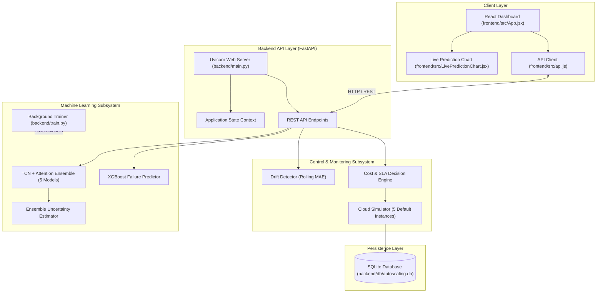

# AutoScale Intelligence AI

> An AI-assisted cloud auto-scaling simulator and interactive dashboard that predicts workload metrics, estimates model uncertainty, classifies failure risks, and executes cost- and SLA-aware compute provisioning decisions.

[](https://github.com/SWEATA06/major.git)
[](https://www.python.org/)
[](https://nodejs.org/)
[](https://fastapi.tiangolo.com/)
[](https://react.dev/)

---

## Table of Contents

- [1. Project Overview](#1-project-overview)
- [2. Objectives](#2-objectives)
- [3. Key Features](#3-key-features)
- [4. System Architecture](#4-system-architecture)
- [5. Technology Stack](#5-technology-stack)
- [6. Repository Structure](#6-repository-structure)
- [7. Prerequisites](#7-prerequisites)
- [8. Installation and Setup (Foolproof Guide)](#8-installation-and-setup-foolproof-guide)
- [9. Environment Variables & Path Configuration](#9-environment-variables--path-configuration)
- [10. Data Pipeline & Machine Learning](#10-data-pipeline--machine-learning)
- [11. API Documentation](#11-api-documentation)
- [12. Running & Verifying the Application](#12-running--verifying-the-application)
- [13. Testing](#13-testing)
- [14. Deployment](#14-deployment)
- [15. Troubleshooting & FAQ (Foolproof Fixes)](#15-troubleshooting--faq-foolproof-fixes)
- [16. Academic / Submission Context](#16-academic--submission-context)
- [17. License & Credits](#17-license--credits)

---

## 1. Project Overview

### What the Project Does
**AutoScale Intelligence AI** is an end-to-end cloud infrastructure auto-scaling simulator and monitoring platform. It ingests time-series server telemetry metrics (CPU usage, memory usage, disk I/O, network throughput, request rate, queue length, and latency), executes predictive machine learning models to forecast near-future workload and assess failure risk, and applies a multi-layered decision engine to scale compute instances up or down dynamically.

### The Problem It Solves
Traditional cloud auto-scalers (such as standard reactive metrics-based auto-scaling rules) respond to workload changes **after** performance degradation or CPU spikes have already occurred. This reactive approach leads to:
- **SLA Violations & High Latency**: Systems experience temporary resource exhaustion while waiting for new instances to spin up.
- **Over-Provisioning & Waste**: Coarse scaling rules frequently leave excess instances running during low-traffic windows, incurring unnecessary cloud costs.
- **Uncertainty Blindness**: Standard auto-scalers do not account for model prediction confidence or sudden metric drift.

### How the Proposed System Solves It
This project implements a **proactive, hybrid AI-driven decision framework**:
1. **Workload Forecasting**: Uses a Temporal Convolutional Network (TCN) augmented with a custom Attention mechanism to forecast future CPU usage and request rate over a 12-step sliding window.
2. **Uncertainty Quantification**: Computes an ensemble variance score across 5 independently trained workload models to prevent scaling decisions when model confidence is low.
3. **Failure Risk Classification**: Uses an XGBoost classifier trained with class-imbalance penalties to estimate binary failure probabilities.
4. **Drift Detection**: Monitors rolling Mean Absolute Error (MAE) between actual and predicted metrics to flag concept drift.
5. **Cost-Aware & SLA-Aware Decision Engine**: Combines predictive CPU, failure risk, uncertainty, latency, queue length, peak hours, and remaining budget to select an optimal scaling action (`urgent_scale_up`, `scale_up`, `conservative_scaling`, `scale_down`, `hold`).
6. **Discrete Cloud Simulator & Interactive Dashboard**: Simulates compute instance adjustments, tracks operational costs and SLA violations, persists metric history to SQLite, and displays live updates on a React dashboard.

### Intended Users
- Cloud & DevOps Engineers inspecting predictive auto-scaling algorithms.
- System Architects evaluating cost-performance trade-offs in cloud resource management.
- Academic Evaluators assessing machine learning applications in systems engineering.

---

## 2. Objectives

- **Proactive Scaling**: Predict workload trends 1 step ahead using time-series deep learning rather than reacting after thresholds are breached.
- **Reliability & Risk Reduction**: Predict imminent system failure risks using XGBoost classification and override cost caps during emergency SLA threats.
- **Cost Optimization**: Use target-tracking and budget awareness to size the fleet, minimizing compute spend without compromising stability.
- **Carbon & Energy Optimization**: Model per-instance energy and time-varying grid carbon intensity, and shift/trim compute towards cleaner grid periods — reducing the carbon footprint of the same workload without ever sacrificing an SLA.
- **Uncertainty & Drift Awareness**: Hold scaling decisions when model uncertainty is high and alert operators when predictive drift occurs.
- **Quantified Comparison**: Evaluate the proactive, carbon-aware scaler against a conventional reactive baseline on real telemetry and report cost, energy, carbon, and SLA outcomes for each.
- **Interactive Simulation**: Provide a web-based dashboard allowing operators to step through simulation intervals, trigger background model re-training, and inspect live performance and sustainability metrics.

---

## 3. Key Features

### Implemented Features
- **Workload Forecasting (TCN + Attention)**: 5-model deep learning ensemble predicting future CPU usage and request rates.
- **Uncertainty Estimation**: Multi-model ensemble variance (standard deviation) used as a confidence gate.
- **Failure Risk Classification**: XGBoost classifier predicting future failure probability with imbalance weighting (`scale_pos_weight`).
- **Carbon-Aware & Energy-Aware Decision Engine**: Multi-tiered decision logic evaluating SLA limits, failure risk, budget, peak hours, model uncertainty, and — as the distinguishing contribution — grid carbon intensity. Uses target-tracking to size the fleet, defers non-urgent scale-ups and trims idle capacity harder when the grid is "dirty", and never trades an SLA breach for cost or carbon savings. Capped by a configurable `max_instances`.
- **Energy & Carbon Model** (`backend/src/energy.py`): Per-instance power scales with load (idle floor `P_idle`=100W to peak `P_max`=250W), multiplied by a Power Usage Effectiveness (PUE) factor. Carbon emitted = energy × grid carbon intensity, where intensity follows a realistic 24-hour curve (clean midday, dirty evening peak).
- **Reactive vs Proactive Comparison Mode** (`backend/src/reactive_scaler.py`): A conventional threshold-based reactive baseline is run over the same workload as the proactive engine, and both are scored on cost, energy, carbon, and SLA violations for a direct, quantified comparison.
- **Real MIT Supercloud Dataset Pipeline** (`backend/src/process_mit_supercloud.py`): Processes real HPC cluster telemetry (CPU utilisation, memory, disk I/O) from the MIT Supercloud dataset into the model-ready 14-column schema.
- **Discrete Cloud Simulator**: State machine tracking instance count, calculating load-adjusted CPU usage ($\text{actual\_cpu} \times \frac{5}{\text{instances}}$), SLA violations (>95% load), load-adjusted latency, step cost, and per-interval energy and carbon.
- **Rolling MAE Drift Detector**: Rolling window monitor (size=50) flagging prediction drift when MAE exceeds threshold; surfaced live via the status endpoint.
- **Mock AI Fallback Mode**: Graceful fallback mode executing synthetic metrics generation if TensorFlow or AVX hardware instructions are unavailable.
- **SQLite Historical Persistence**: Persistence of all simulation intervals (including energy/carbon columns) in an SQLite database (`autoscaling.db`), with an idempotent startup migration that adds new columns to existing databases.
- **Interactive React Dashboard**: Single-page dashboard built with React, Vite, Recharts, and Tailwind CSS featuring operational KPI cards, a row of sustainability indicators (total energy, total carbon, grid carbon intensity), a carbon-intensity-over-time chart, static CSV visualization, and live prediction charts.
- **Background Model Re-Training**: Asynchronous model training execution via FastAPI `BackgroundTasks`.

### Partially Implemented Features
- **Static Chart Data Download**: The dashboard provides CSV download links for static chart data (`/static_chart_data.csv`), but Excel `.xlsx` direct export is served as a static link asset.

### Planned Features (Not Implemented in Codebase)
- Ensemble distillation: compress the 5-model TCN ensemble into a single lightweight student model (knowledge distillation) for faster inference.
- Live grid carbon-intensity feed (e.g. ElectricityMaps / WattTime) in place of the modelled daily curve.
- Learned scaling policy (reinforcement learning) optimising a combined cost + carbon + SLA objective.
- Real-time cloud API integration with AWS Auto Scaling Groups or GCP Managed Instance Groups (*not specified in repository*).
- Authentication and multi-tenant user isolation (*not specified in repository*).

---

## 4. System Architecture



### Component Responsibilities

| Component | File Path | Responsibility |
| :--- | :--- | :--- |
| **API Server** | `backend/main.py` | FastAPI application handling HTTP requests, lifecycle state management, and simulation orchestration. |
| **Model Trainer** | `backend/train.py` | Standalone script for training TCN workload ensemble models and XGBoost failure predictor. |
| **Batch Inference** | `backend/inference.py` | Standalone CLI script for batch evaluation and exporting simulation CSV results. |
| **Workload Predictor** | `backend/src/models/workload_predictor.py` | Keras model definition combining Dilated TCN layers with a custom Attention mechanism. |
| **Uncertainty Estimator** | `backend/src/models/uncertainty_estimator.py` | Computes prediction median and standard deviation across ensemble models. |
| **Failure Predictor** | `backend/src/models/failure_predictor.py` | XGBoost binary classifier predicting probability of future failure. |
| **Drift Detector** | `backend/src/monitoring/drift_detector.py` | Rolling MAE tracker detecting concept drift between predicted and actual CPU metrics. |
| **Decision Engine** | `backend/src/decision_engine.py` | Rules engine converting predictions, risk, uncertainty, SLA, and budget into scaling actions. |
| **Cloud Simulator** | `backend/src/simulator.py` | Simulates instance scaling, calculates adjusted load, checks SLA violations, and computes cost. |
| **Dataset Preprocessor** | `backend/src/build_final_dataset.py` | Transforms raw telemetry into normalized features, time buckets, and synthetic operational metrics. |
| **Database Engine** | `backend/database.py`, `backend/db_models.py` | SQLAlchemy database setup and ORM model (`MetricsHistory`) for SQLite. |
| **React Dashboard** | `frontend/src/App.jsx` | User interface displaying system status, KPI metrics, control buttons, and charts. |
| **Live Prediction Chart** | `frontend/src/LivePredictionChart.jsx` | Recharts line chart rendering live CPU predictions vs. actual CPU usage. |

---

## 5. Technology Stack

| Layer | Technology | Version / Spec | Purpose |
| :--- | :--- | :--- | :--- |
| **Frontend Framework** | React | ^19.2.5 | Building UI components and managing client state |
| **Build Tool & Dev Server** | Vite | ^8.0.10 | Module bundling and fast development HMR |
| **Styling** | Tailwind CSS | ^4.2.4 | Utility-first CSS styling and glassmorphic UI design |
| **Visualization** | Recharts | ^3.8.1 | Rendering dynamic line charts and composed static charts |
| **Icons** | Lucide React | ^1.11.0 | Dashboard iconography |
| **HTTP Client** | Axios | ^1.15.2 | Asynchronous REST API communication |
| **Backend Framework** | FastAPI | >=0.100.0 | High-performance Python REST API framework |
| **ASGI Server** | Uvicorn | >=0.22.0 | Asynchronous server gateway interface |
| **Database / ORM** | SQLite + SQLAlchemy | >=2.0.0 | Relational storage and ORM model mapping |
| **Data Validation** | Pydantic | >=2.0.0 | Request and response schema serialization |
| **Deep Learning** | TensorFlow + Keras-TCN | >=2.12.0 / >=3.5.0 | Temporal Convolutional Network with Attention |
| **Gradient Boosting** | XGBoost | >=1.7.0 | Binary failure risk classification |
| **Machine Learning Utilities** | Scikit-Learn | >=1.2.0 | Feature scaling (`MinMaxScaler`) and evaluation metrics |
| **Data Processing** | Pandas + NumPy | >=2.0.0 / >=1.23.0 | Time-series data manipulation and array processing |
| **Authentication** | *Not specified in repository* | N/A | No authentication or authorization module implemented |
| **Deployment / Container** | *Not specified in repository* | N/A | Local script-based execution (`run_project.bat`) |

---

## 6. Repository Structure

```
major/
├── backend/
│   ├── db/
│   │   └── autoscaling.db           # SQLite database file (created on runtime)
│   ├── models/                      # Saved ML models & feature scalers (.keras, .joblib)
│   │   ├── failure_predictor.joblib
│   │   ├── feature_scaler.joblib
│   │   ├── target_scaler.joblib
│   │   └── workload_tcn_model_*.keras
│   ├── src/
│   │   ├── models/                  # ML architecture implementations
│   │   │   ├── failure_predictor.py
│   │   │   ├── uncertainty_estimator.py
│   │   │   └── workload_predictor.py
│   │   ├── monitoring/
│   │   │   └── drift_detector.py    # Rolling MAE drift detector
│   │   ├── build_final_dataset.py   # Telemetry transformer & feature engine
│   │   ├── clean_dataset.py         # Null/duplicate dataset cleaning
│   │   ├── data_generator.py        # Standalone synthetic telemetry generator
│   │   ├── decision_engine.py       # Cost & SLA auto-scaling decision logic
│   │   ├── feature_engineering.py   # Shifted targets & sliding sequence creator
│   │   ├── merge_dataset.py         # Raw CSV merger script
│   │   ├── simulator.py             # Cloud instance simulation engine
│   │   └── validate_dataset.py      # Dataset validation & correlation inspector
│   ├── database.py                  # SQLAlchemy engine & session setup
│   ├── db_models.py                 # SQLite ORM table definitions
│   ├── inference.py                 # Offline simulation batch runner
│   ├── main.py                      # FastAPI application entry point
│   ├── schemas.py                   # Pydantic API response schemas
│   └── train.py                     # Offline ML model training script
├── data/
│   ├── final/                       # Machine-learning ready CSV datasets
│   │   ├── final_dataset.csv
│   │   └── final_dataset_ready.csv
│   ├── processed/                   # Intermediate cleaned CSV files
│   └── raw/                         # Raw CSV input metrics
├── docs/
│   └── Project_Report.docx          # Academic project documentation
├── frontend/
│   ├── public/                      # Static web assets and static chart CSV data
│   │   └── static_chart_data.csv
│   ├── src/                         # React UI source code
│   │   ├── App.css
│   │   ├── App.jsx                  # Main dashboard layout
│   │   ├── LivePredictionChart.jsx  # Live Recharts CPU component
│   │   ├── api.js                   # Axios HTTP endpoints
│   │   ├── index.css
│   │   └── main.jsx                 # React root entry point
│   ├── package.json                 # Frontend dependencies & scripts
│   ├── tailwind.config.js           # Tailwind styling config
│   └── vite.config.js               # Vite dev server config
├── requirements.txt                 # Backend Python package requirements
├── run.txt                          # Manual startup execution notes
├── run_project.bat                  # Windows batch launcher script
└── visualize_actual_vs_predicted.py # Offline Matplotlib plot visualization tool
```

---

## 7. Prerequisites

Before running this project, ensure your computer has the following tools installed:

### 1. Git
- Download & install Git from [git-scm.com](https://git-scm.com/).
- Verify installation:
  ```bash
  git --version
  ```

### 2. Python (v3.9, v3.10, or v3.11)
- Python **3.9 to 3.11** is required (Python **3.10** recommended).
- Download from [python.org](https://www.python.org/downloads/).
- **Important (Windows)**: During installation, check the box **"Add python.exe to PATH"**.
- Verify installation:
  ```bash
  python --version   # or python3 --version
  ```

### 3. Node.js (v18.0.0 or higher) & npm
- Download the LTS version from [nodejs.org](https://nodejs.org/).
- Verify installation:
  ```bash
  node -v
  npm -v
  ```

---

## 8. Installation and Setup (Foolproof Guide)

Follow these exact step-by-step commands to set up the project on any operating system (Windows, macOS, Linux).

### Step 1: Clone the Repository
Open your terminal (PowerShell, Command Prompt, or Terminal) and run:
```bash
git clone https://github.com/SWEATA06/major.git
cd major
```

---

### Step 2: Set Up Backend Python Virtual Environment

Creating a virtual environment ensures Python dependencies do not conflict with other projects.

#### On Windows (PowerShell):
```powershell
# Create virtual environment
python -m venv venv

# If PowerShell script execution is restricted on your machine, run this once:
Set-ExecutionPolicy -ExecutionPolicy RemoteSigned -Scope Process

# Activate virtual environment
.\venv\Scripts\Activate.ps1
```

#### On Windows (Command Prompt - cmd):
```cmd
python -m venv venv
venv\Scripts\activate.bat
```

#### On macOS / Linux (Terminal):
```bash
python3 -m venv venv
source venv/bin/activate
```

*When activated, your terminal prompt will show `(venv)` at the beginning.*

---

### Step 3: Install Backend Dependencies

With `(venv)` active, run:
```bash
python -m pip install --upgrade pip setuptools wheel
pip install -r requirements.txt
```

> **Note for Apple Silicon (M1/M2/M3) or Python 3.12 users**: If `tensorflow` installation throws a version error, do not panic! The project includes an automatic **Mock AI Fallback Mode**. The backend will continue to work seamlessly even if TensorFlow is omitted.

---

### Step 4: Install Frontend Dependencies

Navigate into the `frontend` folder and install Node packages:
```bash
cd frontend
npm install
cd ..
```

---

## 9. Environment Variables & Path Configuration

### Environment Variables
- **No `.env` file is required.** All default ports and SQLite connection strings are pre-configured to run out of the box.

### Critical PYTHONPATH Requirement (For Manual Backend Launch)
Because Python modules import from `backend.database`, `backend.src`, etc., Python needs to know where the root directory is located.

- **On Windows PowerShell**:
  ```powershell
  $env:PYTHONPATH=(Get-Location).Path
  ```
- **On Windows CMD**:
  ```cmd
  set PYTHONPATH=%CD%
  ```
- **On Linux / macOS**:
  ```bash
  export PYTHONPATH=$(pwd)
  ```

*(If you use `run_project.bat` on Windows, this path is set automatically for you!)*

---

## 10. Data Pipeline & Machine Learning

### Data Pipeline Architecture
The primary dataset is the **MIT Supercloud** HPC cluster telemetry (real per-node CPU traces).
1. **Raw Ingestion & Mapping**: `backend/src/process_mit_supercloud.py` reads the per-node `*-timeseries.csv` files under `data/data/raw/mit_supercloud/cpu/`, orders them chronologically by epoch time, and maps real signals to features: `CPUUtilization → cpu_usage`, `RSS/VMSize → memory_usage`, `ReadMB + WriteMB → disk_io`.
2. **Derived Operational Metrics**: `network_usage`, `request_rate`, `queue_length`, `latency`, and `error_rate` are derived from the physical signals; `hour_of_day`, `day_of_week`, `minute_bucket` come from the real epoch timestamp.
3. **Failure Labelling**: `failure_label` is defined as a genuine compound overload event (sustained high CPU with high latency or elevated errors), tuned to a realistic (~17%) positive rate. Output is written to `data/final/final_dataset.csv` in the 14-column schema.
4. **Target Shifting**: `backend/src/feature_engineering.py` shifts target columns to create supervised labels: `future_cpu_usage`, `future_request_rate`, and `future_failure`.
5. **Sliding Windows**: Constructs sequence arrays $X \in \mathbb{R}^{N \times 12 \times 11}$ with sequence length $T=12$.

> A synthetic generator (`backend/src/generate_ready_dataset.py`) is also provided so the app can run on a fresh checkout without the raw MIT data.

### Machine Learning Models
- **Workload Predictor**: 5 Keras models trained with EarlyStopping. Architecture consists of a `TCN` layer (`nb_filters=64`, `kernel_size=3`, dilations `[1, 2, 4, 8, 16]`), followed by a custom `AttentionLayer` and a linear output layer predicting `future_cpu_usage` and `future_request_rate`. **Models are persisted as weights (`workload_tcn_model_{i}.weights.h5`) and the architecture is rebuilt at load time**, because keras-tcn's `TCN`/`ResidualBlock` does not round-trip through full-model serialization on Keras 3. Feature and target `MinMaxScaler`s are saved and applied consistently at train and inference time.
- **Uncertainty Estimator**: Evaluates median prediction and standard deviation across the 5 models.
- **Failure Predictor**: XGBoost classifier trained on a non-shuffled time-series split (`train_test_split(..., shuffle=False)`) with `scale_pos_weight` to address class imbalance. On the MIT dataset: Accuracy ≈ 0.69, Recall ≈ 0.62, ROC-AUC ≈ 0.72.

---

## 11. API Documentation

The FastAPI backend exposes the following REST API endpoints at `http://127.0.0.1:8000`:

| Endpoint | Method | Purpose | Request Body | Response Format |
| :--- | :--- | :--- | :--- | :--- |
| `/api/system/status` | `GET` | Get overall server status, model status, and current instance count | None | `{"status": str, "models_loaded": bool, "current_instances": int, "recent_drift": bool}` |
| `/api/scale/run` | `POST` | Execute one simulation step, run inference, compute decision, update DB | None | `MetricOut` JSON object |
| `/api/metrics/current` | `GET` | Fetch the latest metric record from database | None | `MetricOut` JSON object |
| `/api/timeline` | `GET` | Fetch historical metric records for dashboard charts | Query param: `limit` (default 100) | Array of `MetricOut` objects |
| `/api/predictions/latest` | `GET` | Fetch latest prediction output for live charts | None | `{"actual": float, "predicted": float, "timestamp": int}` |
| `/api/energy/summary` | `GET` | Aggregated energy/carbon totals across all simulation steps | None | `{"total_energy_kwh": float, "total_carbon_g": float, "total_carbon_kg": float, "avg_carbon_intensity": float, "total_cost": float, "steps": int}` |
| `/api/comparison/scalers` | `GET` | Run reactive baseline vs proactive engine over the same workload and return comparative metrics | Query param: `steps` (default 200) | `{"steps": int, "reactive": {...}, "proactive": {...}, "improvements": {...}}` |
| `/api/model/train` | `POST` | Trigger background execution of model training pipeline | None | `{"status": str, "message": str}` |

### MetricOut Schema Example
```json
{
  "id": 42,
  "timestamp": 1725390000000,
  "instances": 6,
  "actual_cpu": 78.4,
  "predicted_cpu": 81.2,
  "failure_prob": 0.12,
  "uncertainty": 2.45,
  "action": "scale_up",
  "latency": 45.2,
  "cost": 0.60,
  "energy_kwh": 0.188,
  "carbon_g": 47.08,
  "carbon_intensity": 250.0,
  "drift_detected": false
}
```

---

## 12. Running & Verifying the Application

### Option A: One-Click Launch (Windows Users)

From the root directory `major/`, simply double-click or run:
```cmd
run_project.bat
```
This script will automatically:
1. Open a new window for the **Backend** server (`http://127.0.0.1:8000`).
2. Open a new window for the **Frontend** dev server (`http://localhost:5173`).

---

### Option B: Manual Step-by-Step Launch (All Platforms: Windows, Mac, Linux)

#### 1. Open Terminal 1: Launch Backend API
From the root directory `major/` with your virtual environment activated:

**PowerShell (Windows):**
```powershell
$env:PYTHONPATH=(Get-Location).Path
python -m uvicorn backend.main:app --host 127.0.0.1 --port 8000 --reload
```

**Terminal (macOS / Linux):**
```bash
export PYTHONPATH=$(pwd)
python3 -m uvicorn backend.main:app --host 127.0.0.1 --port 8000 --reload
```

*You should see output ending with: `INFO: Application startup complete. INFO: Uvicorn running on http://127.0.0.1:8000`*

---

#### 2. Open Terminal 2: Launch Frontend Web Dashboard
From the root directory `major/`:
```bash
cd frontend
npm run dev
```

*You should see output ending with: `VITE v8.x.x ready in ... ms  ➜  Local: http://localhost:5173/`*

---

### 3. Open and Verify in Your Browser

1. Open your web browser and navigate to:
   - **Interactive Dashboard**: `http://localhost:5173`
   - **FastAPI Interactive Swagger Docs**: `http://127.0.0.1:8000/docs`

2. **Verify System Status**:
   - On the top right of the dashboard, you will see a badge: **"AI Core Online"** (or **"Models Offline"** if models need training).

3. **Train Models (If Models are Offline)**:
   - Click the **"Train Models"** button in the header.
   - The backend will train the TCN ensemble and XGBoost models in the background.

4. **Run Simulation Steps**:
   - Click **"Step Forward"** to execute individual simulation intervals. Watch the **Active Instances**, **Predicted CPU**, **Failure Risk**, and **Decision Cost** cards update instantly.
   - Click **"Auto Simulate"** to enable automatic simulation stepping every 2 seconds.

---

## 13. Testing

- Automated unit and integration test suites (e.g., `pytest`, `Jest`) are **not specified in the repository**.
- Application functionality is verified manually via the interactive React dashboard or by running the offline simulation batch runner:
```bash
python backend/inference.py
```

---

## 14. Deployment

- Production deployment configurations (such as Docker, Docker Compose, Kubernetes manifests, or Terraform scripts) are **not specified in the repository**.
- The project is designed for local development, demonstration, and evaluation execution.

---

## 15. Troubleshooting & FAQ (Foolproof Fixes)

### Q1: Error `ModuleNotFoundError: No module named 'backend'`
* **Cause**: Python cannot find the `backend` folder because `PYTHONPATH` is not set in your terminal.
* **Fix**: Run the command corresponding to your terminal before starting Uvicorn:
  - PowerShell: `$env:PYTHONPATH=(Get-Location).Path`
  - CMD: `set PYTHONPATH=%CD%`
  - Bash/Zsh: `export PYTHONPATH=$(pwd)`

---

### Q2: PowerShell says `cannot be loaded because running scripts is disabled`
* **Cause**: Windows PowerShell security policy blocks virtual environment activation scripts.
* **Fix**: Open PowerShell as User and run:
  ```powershell
  Set-ExecutionPolicy -ExecutionPolicy RemoteSigned -Scope Process
  ```
  Then re-run `.\venv\Scripts\Activate.ps1`.

---

### Q3: Address already in use (`error [Errno 98] or [WinError 10048]`)
* **Cause**: Port 8000 or 5173 is already being used by another application or previous backend instance.
* **Fix**:
  - Close any existing PowerShell / Terminal windows running Uvicorn or Vite.
  - Or run backend on a different port:
    ```bash
    python -m uvicorn backend.main:app --host 127.0.0.1 --port 8001 --reload
    ```

---

### Q4: "Hardware limitation detected (AVX/TensorFlow). Enabling Mock AI Mode..."
* **Cause**: Your CPU lacks AVX instructions or TensorFlow is not installed.
* **Fix**: This is **normal fallback behavior**. The backend automatically detects this and switches to **Mock AI Mode**, generating realistic synthetic telemetry so you can evaluate the auto-scaler and UI without needing GPU/AVX hardware.

---

### Q5: Dashboard displays "Models not loaded or end of data"
* **Cause**: Pre-trained model files are missing from `backend/models/`, or the dataset step index reached the end of `final_dataset_ready.csv`.
* **Fix**: Click **"Train Models"** on the React dashboard or run:
  ```bash
  python backend/train.py
  ```

---

## 16. Academic / Submission Context

- **Project Title**: AutoScale Intelligence AI: Predictive Analytics & Cost-Aware Cloud Provisioning.
- **Project Type**: Undergraduate / Graduate Final Year Major Project.
- **Domain**: Cloud Computing, Predictive Resource Provisioning, Applied Machine Learning.
- **Project Documentation Artifact**: A detailed academic project report is available under `docs/Project_Report.docx`.
- **Core Value Proposition**: Demonstrates proactive cloud auto-scaling using hybrid deep learning (TCN + Attention) and gradient boosting (XGBoost) within a cost- and SLA-constrained simulation environment.

---

## 17. License & Credits

### Repository URL
- GitHub: [https://github.com/SWEATA06/major.git](https://github.com/SWEATA06/major.git)

### Authors & Contributors
- **Avish Chawla**
- **Sweata**

### Acknowledgments
Developed as a Major Project for cloud resource optimization and predictive analytics evaluation.
